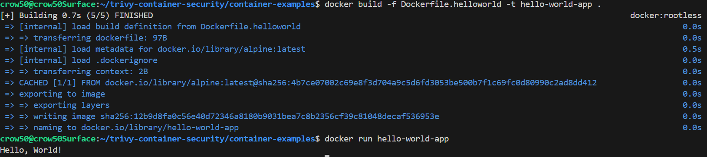
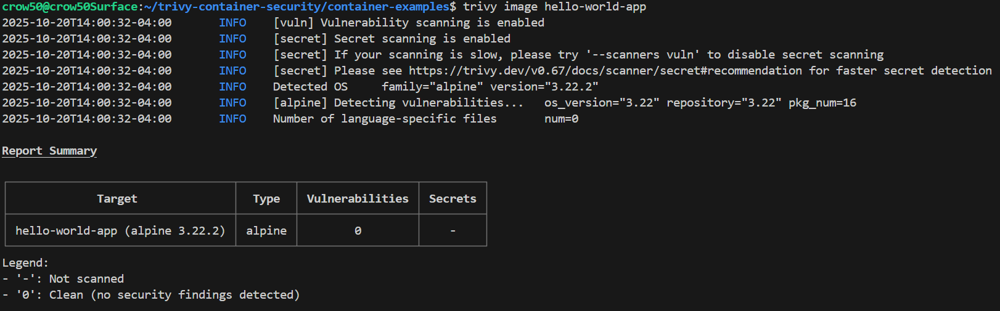
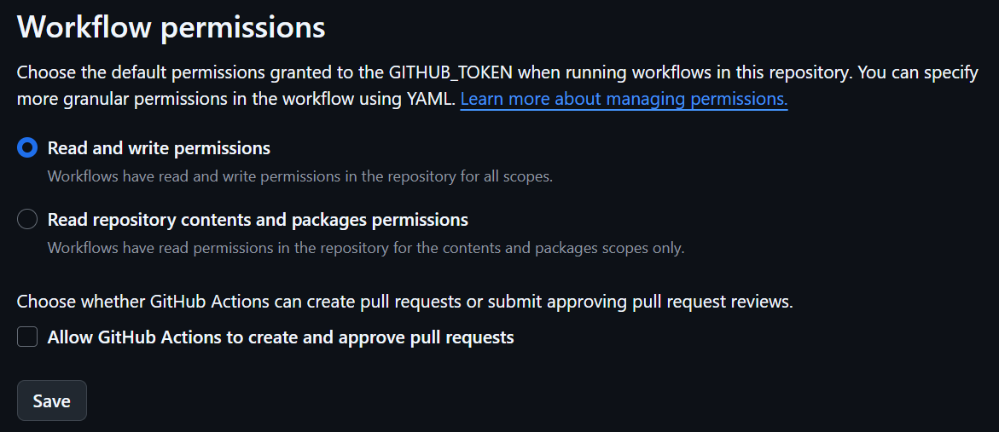
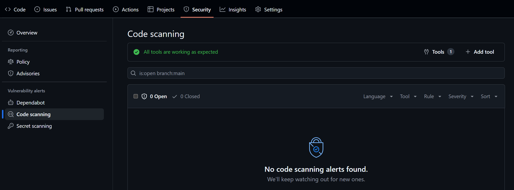
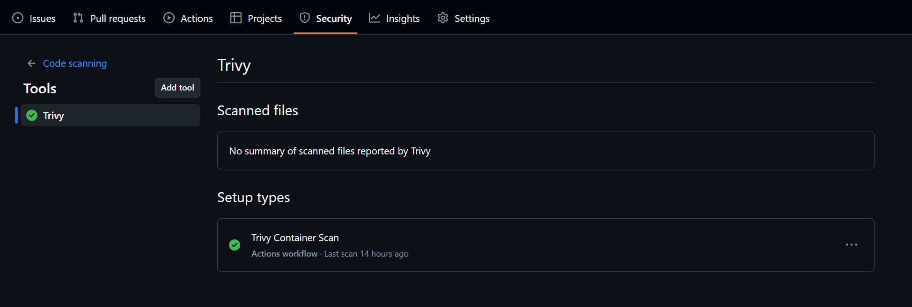
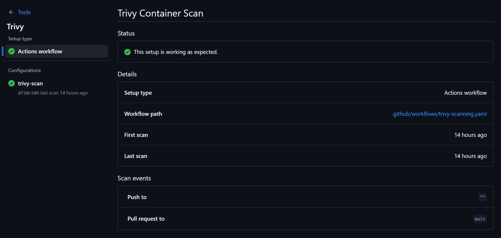

# Trivy - Security Scanning for Containers and more

[](https://github.com/crow50/trivy-container-security/actions/workflows/trivy-scanning.yaml)

[Trivy](https://trivy.dev/) is a comprehensive security scanner that is capable of scanning container images, file systems, GitHub repos and more. Trivy is capable of finding OS package and software dependencies, CVEs, [secrets](https://crow50.github.io/Gitleaks-Secret-Scanning/#what-counts-as-a-secret), and IaC issues. 

For this project, I will be using Trivy to demonstrate container image scanning.

---

## What is Trivy?

[Trivy](https://trivy.dev/), like [Gitleaks](https://gitleaks.io/), is an open-source security scanning tool used in CI/CD environments to find and report potential security vulnerabilities. Trivy focuses on scanning container images, file systems, and Git repositories for known vulnerabilities in OS packages and application dependencies.

---

## What is Container Scanning?

Container scanning is the process of analyzing container images for known vulnerabilities, misconfigurations, and compliance issues. This is necessary for maintaining the security and integrity of applications deployed in containerized environments.

A container image, in our case a Docker image, consists of many layers as defined in a given Dockerfile. A Dockerfile is a text document that contains all the commands used to build an application.

A Dockerfile usually includes:
- Base image
- Application code
- Installation dependencies

Each layer in a container image can potentially introduce vulnerabilities, especially if it includes outdated or unpatched software packages. Trivy scans these layers to identify known vulnerabilities and provides detailed reports.

---

## Project Setup

### Local Development

1. Install Docker: Ensure Docker is installed on your local machine. You can download it from [here](https://www.docker.com/products/docker-desktop).

2. Install Trivy: Follow the installation instructions from the [official Trivy documentation](https://trivy.dev/docs/latest/getting-started/).

3. Create a Dockerfile

```bash
cd container-examples
touch Dockerfile
```

4. Build a Docker Image

```bash
cd container-examples
docker build -f Dockerfile -t hello-world-app .
```

5. Scan with Trivy

```bash
trivy image hello-world-app
```

6. Review

---
## Example Dockerfile

```Dockerfile
FROM alpine:latest

CMD ["echo", "Hello, World!"]
```



---

## Basic Trivy Scan Command

With our example Dockerfile and built image, we can run a basic Trivy scan using the following command:

```bash
trivy image hello-world-app
```

This command will analyze the `hello-world-app` Docker image for known vulnerabilities and provide a report in our terminal:



From here, we can see by default that Trivy scans our image by checking for vulnerabilities first, then secrets, then OS detection.

---

## Trivy GitHub Action

Trivy can also be integrated into CI/CD pipelines using GitHub Actions. This allows for automated scanning of container images during the build process.

Our GitHub Actions workflow file `.github/workflows/trivy-scanning.yaml` is set up to build the Docker image and run Trivy scans on it.

1. First we build the Docker image with Buildx:

```yaml
- name: Set up Docker Buildx
  uses: docker/setup-buildx-action@v3

- name: Build Docker image
  run: docker build -t hello-world-app:${{ github.sha }} . # -t allows us to set the tag flag for our Docker image
```

2. Next, we run the Trivy scan for critical vulnerabilities:

```yaml
- name: Run Trivy scan
  uses: aquasecurity/trivy-action@0.33.1 # Current stable version of Trivy Action
  with:
    image-ref: hello-world-app:${{ github.sha }} # Scan the image built in the previous step specifying the image reference
    format: table # Output format for the scan results
    exit-code: '1'
    severity: 'CRITICAL,HIGH' # Only fail the job if CRITICAL or HIGH severity vulnerabilities are found
```

3. Finally, we generate a SARIF report and upload it to the GitHub Security tab:

```yaml
- name: Run Trivy and generate SARIF report
  uses: aquasecurity/trivy-action@0.33.1
  with:
    image-ref: hello-world-app:${{ github.sha }}
    format: 'sarif'
    output: 'trivy-results.sarif'

- name: Upload Trivy scan results to GitHub Security tab
  uses: github/codeql-action/upload-sarif@v3
  if: always()
  with:
    sarif_file: 'trivy-results.sarif'
```

This step requires the giving the workflow permission to write to the Security tab. This can be done by enabling the "Read and write permissions" option in the workflow settings. **Beware** that this will effect the default behaviour of all workflows in the repository.



**Permissions:**
<br>A more granular option is to specify the permissions at the job or step level within the workflow file. This will likely work for public repositories, but private ones will likely need a token.

```yaml
permissions:
  contents: read
  security-events: write
  actions: read
```

**Our complete GitHub Actions workflow file looks like this:**

```yaml
name: Trivy Container Scan

on:
  push:
  pull_request:
    branches:
      - main

jobs:
  trivy-scan:
    runs-on: ubuntu-latest

    # Set permissions for the job to allow uploading SARIF reports
    permissions:
      contents: read
      security-events: write
      actions: read

    steps:
      - name: Checkout code
        uses: actions/checkout@v5

        # Building the Docker image to be scanned
      - name: Set up Docker Buildx
        uses: docker/setup-buildx-action@v3

      - name: Build Docker image
        run: docker build -t hello-world-app:${{ github.sha }} .

        # Scanning the Docker image with Trivy
        # Step will fail if CRITICAL or HIGH severity vulnerabilities are found
      - name: Run Trivy scan
        uses: aquasecurity/trivy-action@0.33.1
        with:
          image-ref: hello-world-app:${{ github.sha }}
          format: table
          exit-code: '1'
          severity: 'CRITICAL,HIGH'

        # Generating SARIF report and uploading to GitHub Security tab
      - name: Run Trivy and generate SARIF report
        uses: aquasecurity/trivy-action@0.33.1
        with:
          image-ref: hello-world-app:${{ github.sha }}
          format: 'sarif'
          output: 'trivy-results.sarif'

      - name: Upload Trivy scan results to GitHub Security tab
        uses: github/codeql-action/upload-sarif@v3
        if: always()
        with:
          sarif_file: 'trivy-results.sarif'
```

---

## Conclusion

During this project we setup Trivy for container image scanning locally and in a GitHub Actions Workflow. 

In our workflow we built an image from the Dockerfile, scanned it for CRITICAL and HIGH severity vulnerabilities, and generated a SARIF report which was then uploaded to our GitHub Security tab. 

If all of that is true, you should see something like this in your Security tab:

**Code Scanning Report:**


**Trivy Tool Security Report:**
<br>*Note: The Trivy report will only show up if vulnerabilities are found in the scanned image.*


**Trivy Setup in Security Tools:**
<br>*Shows us our Trivy integration and when the last scan was run.*


---

## Additional Trivy Uses and Workflow Examples

### File System Scanning

Trivy can also scan file systems for vulnerabilities. This is useful for checking the security of local files and directories.

```yaml
- name: Run Trivy vulnerability scanner in repo mode
  uses: aquasecurity/trivy-action@master
  with:
    scan-type: 'fs'
    ignore-unfixed: true
    format: 'sarif'
    output: 'trivy-results.sarif'
    severity: 'CRITICAL'
```

**Note:** If you desire to upload the SARIF report generated from a file system scan to the GitHub Security tab, you will need and additional `category` value into the upload step like so:

```yaml
- name: Upload Trivy scan results to GitHub Security tab
  uses: github/codeql-action/upload-sarif@v3
  if: always()
  with:
    sarif_file: 'trivy-results.sarif'
    category: 'Trivy File System Scan' # Custom category for file system scans
```

### Skip Setup

[Trivy docs](https://github.com/aquasecurity/trivy-action?tab=readme-ov-file#skipping-setup-when-calling-trivy-action-multiple-times) tell us how to skip setup when calling Trivy Action multiple times in a workflow.

```yaml
  - name: Scan FS without Trivy setup
        uses: aquasecurity/trivy-action@master
        with:
          scan-type: "fs"
          format: table
          scan-ref: .
          # On a subsequent call to the action we know trivy is already installed so can skip this
          skip-setup-trivy: true
```

